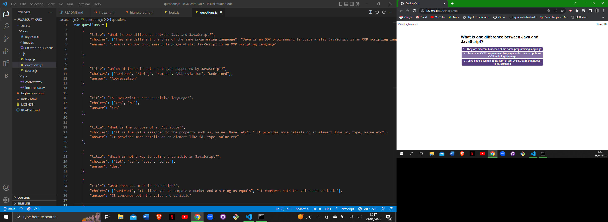
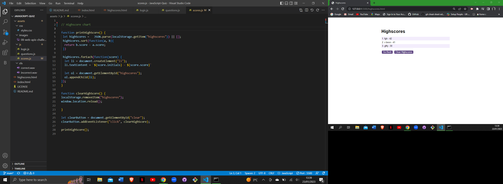

# JavaScript Quiz

## User Story

AS A coding boot camp student
I WANT to take a timed quiz on JavaScript fundamentals that stores high scores
SO THAT I can gauge my progress compared to my peers

## Description

In this project I have used HTML, CSS and JavaScript to create a quiz for students studying JavaScript. The quiz contains for following componants:

  * A start button that when clicked a timer starts and the first question appears.
  * Questions contain buttons for each answer.
  * When answer is clicked, the next question appears.
  * If the answer clicked was incorrect then subtract time from the clock.
  * A different sound signals for when a question is answered either correctly or incorectly.
  * The quiz ends when all questions are answered or the timer reaches 0.
  * When the game ends, it displays the score and give the user the ability to save their initials and their score
  
## Deployed Link:

## Repository Link:

## Usage

### License

Licensed under the MIT license.